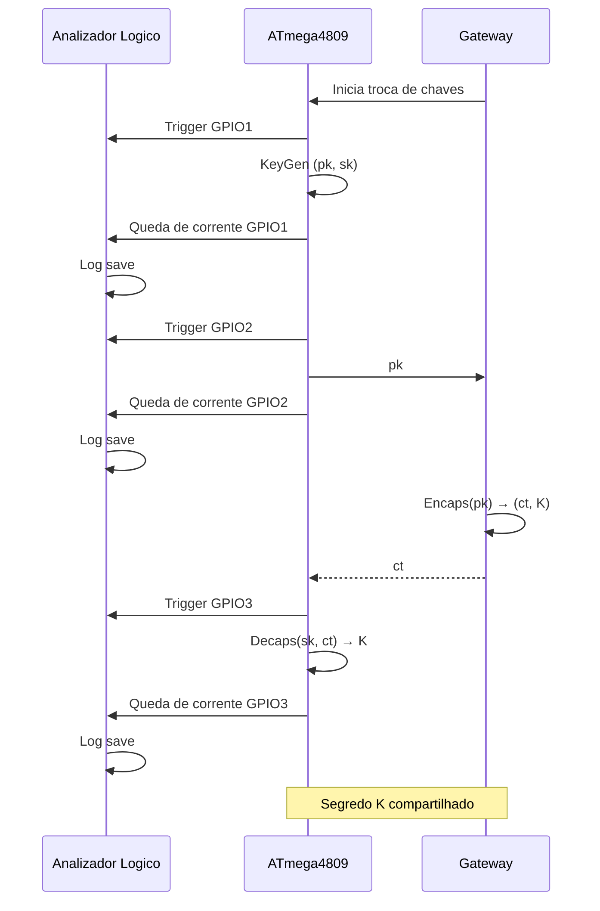

```mermaid
sequenceDiagram
    participant OSC as Analizador Logico
    participant MCU as ATmega4809
    participant GW as Gateway
    GW->>MCU: Inicia troca de chaves  
    MCU->>OSC: Trigger GPIO1
    MCU->>MCU: KeyGen (pk, sk)
    MCU->>OSC: Queda de corrente GPIO1
    OSC->>OSC: Log save
    MCU->>OSC: Trigger GPIO2
    MCU->>GW: pk
    MCU->>OSC: Queda de corrente GPIO2
    OSC->>OSC: Log save
    GW->>GW: Encaps(pk) → (ct, K)
    GW-->>MCU: ct
    MCU->>OSC: Trigger GPIO3
    MCU->>MCU: Decaps(sk, ct) → K
    MCU->>OSC: Queda de corrente GPIO3
    OSC->>OSC: Log save
    Note over MCU,GW: Segredo K compartilhado
```